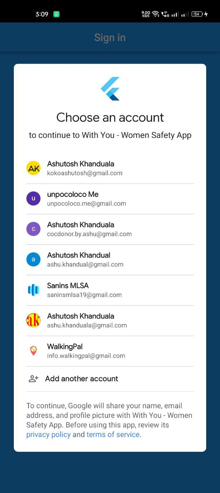
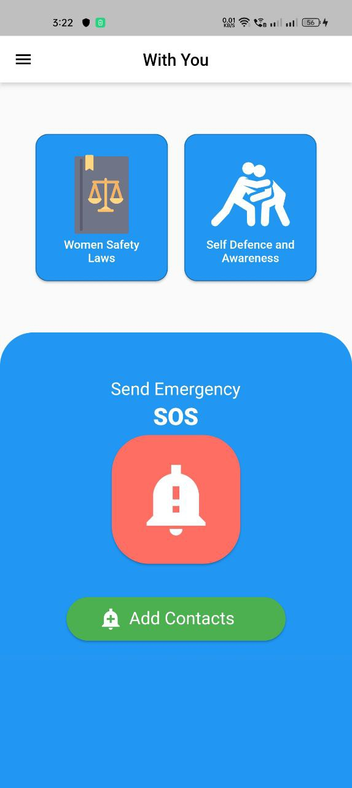
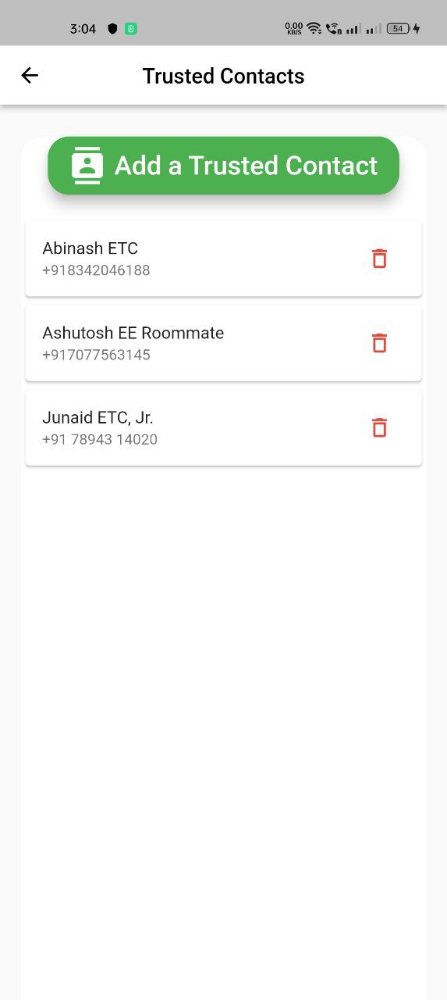
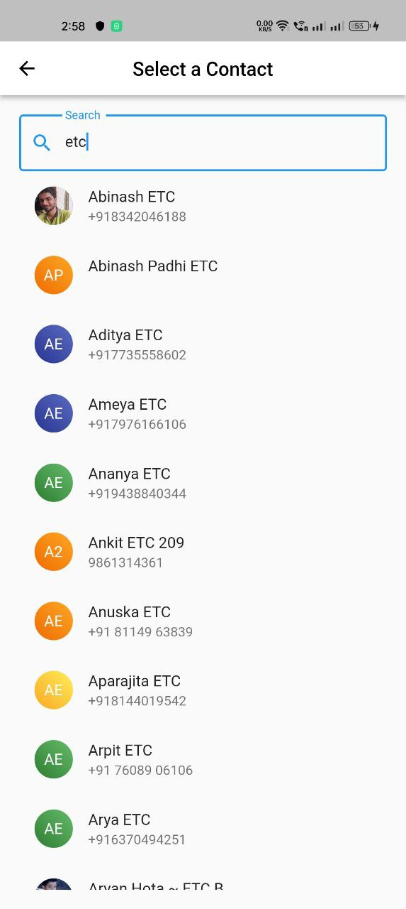
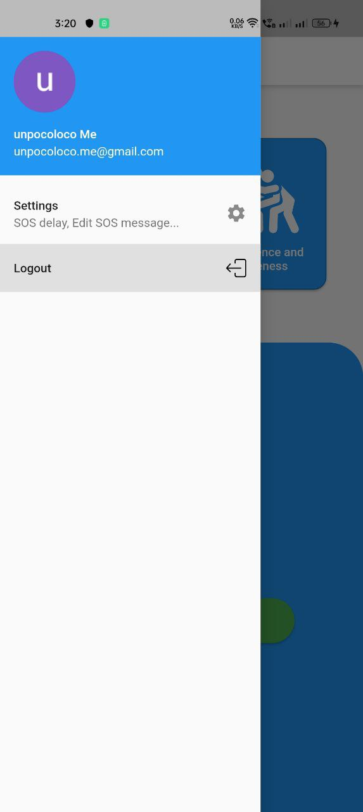
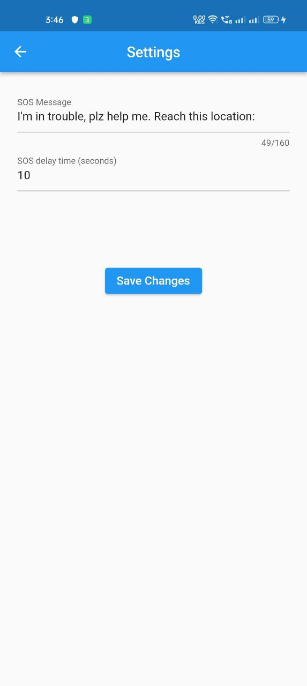

# Withyou - Women safety app 

An App that can **send current location of the user** to her *trusted list* of contacts when in danger with just one tap **via SMS**.
This project was a created on Google DSC WoW Hackathon'21

### Checkout the app release and report issues you find!

An app dedicated towards woman safety. Keeping in view about the increasing cases of threats on women.
Currently this app is compatible with Android only.

### Find it on

hazukashidana🙂

 
It's a hackathon project. This app may not have a very beautiful UI but I gave it my best shot. 
I gave flutter a try for the first time and it was a great experience. I learned a lot of new things and I am really happy with the result.
(PS- I am a React Native developer to the core. I was just curious to try flutter.)

### Flowchart - App working
[Here's the Flowchart](https://bit.ly/wsaFlowchart) made in Excalidaw to show how this app works!

### Screenshots

#### Sign in screen

<table>
  <tr>
    <td></td>
    <td></td>
  </tr>
</table>

#### Home screen

#### Trusted contacts screen
<table>
  <tr>
    <td></td>
    <td></td>
  </tr>
</table>

#### Drawer & Settings screen
<table>
  <tr>
    <td></td>
    <td></td>
  </tr>
</table>

## Development Plans

- Current Release v1.1.0 is all ready to use (SOS featue works fine). It has a new polished UI and added major improvements in User Experience.

- Release v2.0.0 will bring on improvements and add Articles screen and Video Library screens (to be implemented). (see Projects tab) 

- Contributions via PRs are appreciated

## Project Explanation

We have created an app which includes the following
1. Homescreen
   - has navigations to other two screens.
   - has our main SOS feature (sending location sms to added trusted contacts)

2. (Pending) Youtube video fetching screen ( fetches self defence and safety awareness videos using YouTube Data API v3)

3. (Pending) Make screen/s showing all about IPC 1860 for women. It would like an awareness documentation stuff.

<!-- ## Getting Started

This project is a starting point for a Flutter application.

A few resources to get you started if this is your first Flutter project:

- [Lab: Write your first Flutter app](https://docs.flutter.dev/get-started/codelab)
- [Cookbook: Useful Flutter samples](https://docs.flutter.dev/cookbook)

For help getting started with Flutter development, view the
[online documentation](https://docs.flutter.dev/), which offers tutorials,
samples, guidance on mobile development, and a full API reference. -->
